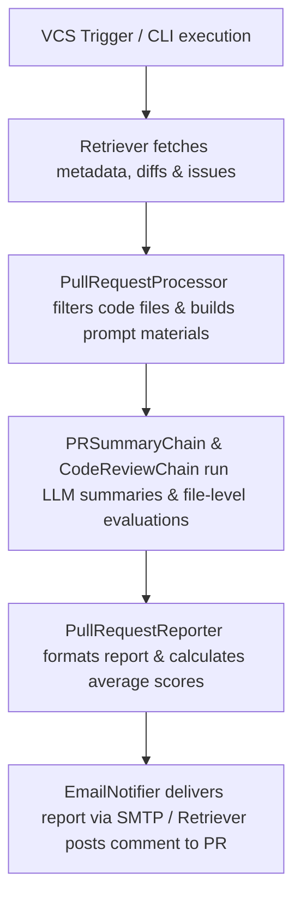

# CodeWatch (CodeDog) Codebase Audit & Architectural Review

This document contains a staff-engineer level architectural review, security and performance audit, and actionable refactoring plan for the CodeWatch/CodeDog project.

---

## Executive Summary

**CodeWatch (CodeDog)** is a modular, AI-powered code review and developer code evaluation tool. It automates reviewing Pull Requests/Merge Requests (GitHub, GitLab) or individual commits (local or remote), generates structured markdown reviews with score tables, and emails them.

While the project has a well-designed modular core using Pydantic models for data representation and LangChain for LLM orchestration, it has several technical debts, security vulnerabilities, and reliability issues.

*   **Production Readiness Score**: **5/10** (Due to insecure credential loading, lack of automated input validation, blocking synchronous patterns in async servers, and missing dependency configurations).
*   **Maintainability Score**: **6/10** (Clear modular separations but relies on outdated LangChain abstractions like `LLMChain` instead of LCEL, has duplicated logic in translation chains, and possesses a confusing mix of English and Chinese documentation/prompts).
*   **Scalability Score**: **4/10** (Lack of queue mechanisms in webhooks, synchronous thread creation per request, and potential rate-limiting bottlenecks for large code repositories).
*   **Overall Project Score**: **5.5/10**

---

## Phase 1 — Project Understanding

### Project Purpose
To automate code quality reviews and developer contribution analysis by using Large Language Models to evaluate git diffs, generate summaries, score changes across multiple dimensions, and email reports.

### Target Users
- **Individual Developers**: Self-review commits prior to publishing PRs.
- **Engineering Leads & Managers**: Auto-generate PR code quality assessments and track code statistics (additions, deletions, effective lines) over time.
- **DevOps/Platform Teams**: Integrate automated LLM-based gatekeeping into CI/CD pipelines or VCS webhooks.

### Major Features
1.  **PR/MR Code Review**: Automatically fetches a PR/MR, analyzes the file diffs, writes a summary, generates reviews, and posts the report.
2.  **Commit Review**: Directly reviews a local commit or remote commit by its hash.
3.  **Developer Contribution Evaluation**: Queries a developer's commits over a custom timeframe, generates code quantity metrics, and reviews the qualitative changes.
4.  **Local Git Hooks**: Automatically reviews commits using git post-commit triggers.
5.  **Multi-Model Support**: Custom integrations with OpenAI, Azure OpenAI, and DeepSeek (including reasoning models).
6.  **Email Notifications**: Integrates with SMTP servers to email generated Markdown reports in plain text/HTML format.

### Core Workflows


---

## Phase 2 — Component Breakdown

We break down the major components below:

### 1. `GithubRetriever` & `GitlabRetriever`
- **Files**: [github_retriever.py](file:///c:/Users/chgya/OneDrive/문서/CodeWatch/codedog/retrievers/github_retriever.py), [gitlab_retriever.py](file:///c:/Users/chgya/OneDrive/문서/CodeWatch/codedog/retrievers/gitlab_retriever.py)
- **Purpose**: Retrieve repository metadata, PR/MR objects, file changes, diff contents, and associated issue details.
- **Inputs**: PyGithub/python-gitlab client instances, repository name/id, PR/MR number.
- **Outputs**: Agnostic Pydantic models: `PullRequest`, `Repository`, `ChangeFile`, `Issue`.
- **Dependencies**: `PyGithub`, `python-gitlab`, `unidiff`, `re`.
- **Internal State**: Caches the retrieved git models and mapped internal models.
- **External State**: None.
- **API/Socket Usage**: Rest calls to GitHub/GitLab REST APIs.
- **Complexity**: High (Must handle API discrepancies between GitHub/GitLab, paginated responses, and raw diff parsing using unidiff).
- **Reusability Score**: 8/10.
- **Potential Issues**:
  - GitLab retriever list diff limit is hardcoded to 200 ([gitlab_retriever.py:L28](file:///c:/Users/chgya/OneDrive/문서/CodeWatch/codedog/retrievers/gitlab_retriever.py#L28)). Large PRs will truncate without notice.
  - Exception handling is generic; API rate-limits or invalid authentication credentials will crash the retrievers.
- **Suggested Refactors**: Implement pagination for GitLab diffs and standard exception handlers for HTTP 403 (Rate Limit) or HTTP 401 (Unauthorized) errors.

### 2. `PullRequestProcessor`
- **File**: [pull_request_processor.py](file:///c:/Users/chgya/OneDrive/문서/CodeWatch/codedog/processors/pull_request_processor.py)
- **Purpose**: Process `PullRequest` data and generate text "materials" to inject into LLM prompts.
- **Inputs**: `PullRequest`, lists of `ChangeFile` or `ChangeSummary` objects.
- **Outputs**: Formatted prompt material strings.
- **Dependencies**: `Localization` mixin, `itertools`.
- **Internal State**: Cached template mapping functions.
- **External State**: None.
- **Complexity**: Low.
- **Reusability Score**: 9/10.
- **Potential Issues**:
  - `SUPPORT_CODE_FILE_SUFFIX` is hardcoded to `["py", "java", "go", "js", "ts", "php", "c", "cpp", "h", "cs", "rs"]` ([pull_request_processor.py:L12](file:///c:/Users/chgya/OneDrive/문서/CodeWatch/codedog/processors/pull_request_processor.py#L12)). If a developer writes Rust (`.rs`), Go (`.go`), or other languages not explicitly covered, they cannot customize this extension list without modifying the library source code.
- **Suggested Refactors**: Make file type extensions configurable via `.env` or initialization parameters.

### 3. `PRSummaryChain` & `CodeReviewChain`
- **Files**: [pr_summary/base.py](file:///c:/Users/chgya/OneDrive/문서/CodeWatch/codedog/chains/pr_summary/base.py), [code_review/base.py](file:///c:/Users/chgya/OneDrive/문서/CodeWatch/codedog/chains/code_review/base.py)
- **Purpose**: Orchestrate LangChain chains to summarize file-level changes, overall PR summaries, and write code suggestions.
- **Inputs**: `PullRequest`.
- **Outputs**: Mapped Pydantic summaries (`PRSummary`, `ChangeSummary`, `CodeReview`).
- **Dependencies**: `langchain`, `LLMChain`, Pydantic models.
- **Internal State**: None.
- **Complexity**: Medium.
- **Reusability Score**: 7/10.
- **Potential Issues**:
  - Deprecated subclassing of `Chain` and usage of `LLMChain` which triggers Pydantic v1 shim warnings on modern LangChain versions.
  - In `PRSummaryChain._aprocess_result` ([base.py:L175-183](file:///c:/Users/chgya/OneDrive/문서/CodeWatch/codedog/chains/pr_summary/base.py#L175-183)), the return format is inconsistent with sync methods. It returns `{"pr_summary": raw_output_text, ...}` which is a string instead of a `PRSummary` object, resulting in a type mismatch.
- **Suggested Refactors**: Migrate chains to LangChain Expression Language (LCEL) and ensure async results are correctly parsed into `PRSummary` models.

### 4. `CodeReviewMarkdownReporter`
- **File**: [code_review.py](file:///c:/Users/chgya/OneDrive/문서/CodeWatch/codedog/actors/reporters/code_review.py)
- **Purpose**: Generate the review report in Markdown, including extracting and averaging dimensional scores.
- **Inputs**: `list[CodeReview]`.
- **Outputs**: Markdown string.
- **Dependencies**: `re`, `json`, `Localization`.
- **Internal State**: Caches parsed scores.
- **Complexity**: Medium.
- **Reusability Score**: 8/10.
- **Potential Issues**:
  - Score extraction depends on regex parsing of unstructured LLM outputs ([code_review.py:L24-111](file:///c:/Users/chgya/OneDrive/문서/CodeWatch/codedog/actors/reporters/code_review.py#L24-L111)). If the model varies its spacing or markdown formatting slightly, the score parser fails and returns `0`, breaking the average calculation.
- **Suggested Refactors**: Use structured output models or JSON mode for the code reviews to enforce schema validation at the API level instead of post-hoc regex parsing.

### 5. `DeepSeekChatModel` & `DeepSeekR1Model`
- **File**: [langchain_utils.py](file:///c:/Users/chgya/OneDrive/문서/CodeWatch/codedog/utils/langchain_utils.py)
- **Purpose**: Custom LangChain BaseChatModel wrappers for DeepSeek APIs, introducing exponential backoff and retry handling.
- **Inputs**: List of `BaseMessage`.
- **Outputs**: `ChatResult`.
- **Dependencies**: `requests`, `aiohttp`, `langchain_core`.
- **Internal State**: Tracks token usage, costs, and retry statistics.
- **Complexity**: Medium-High.
- **Reusability Score**: 9/10.
- **Potential Issues**:
  - Synchronous `_generate` uses `requests.post` and does not implement retries or backoff, while `_agenerate` does ([langchain_utils.py:L70-152](file:///c:/Users/chgya/OneDrive/문서/CodeWatch/codedog/utils/langchain_utils.py#L70-L152)).
  - Hardcoded pricing formula ($0.0001 per token) is inaccurate and doesn't separate input and output tokens.
- **Suggested Refactors**: Apply retry logic to the synchronous generator and align token pricing with DeepSeek's official API specifications.

---

## Phase 3 — Frontend Architecture Review

CodeWatch is a command-line application and headless backend system; it does not contain a frontend GUI. However, it generates user-facing representations via:
1.  **Markdown Reports**: Stored locally or posted to Git PR/MR comments.
2.  **HTML/Text E-mails**: Sent via SMTP.

### Evaluation of Presentation Layer
- **Aesthetic Quality**: The generated reports are cleanly structured but simple. They lack modern layout enhancements such as collapsible sections for secondary details or stylized tables.
- **Accessibility**: The generated markdown lacks proper semantic alt tags for embedded links or warning blocks.
- **Separation of Concerns**: Output templates are mixed directly with structural logic inside [template_en.py](file:///c:/Users/chgya/OneDrive/문서/CodeWatch/codedog/templates/template_en.py) and [template_cn.py](file:///c:/Users/chgya/OneDrive/문서/CodeWatch/codedog/templates/template_cn.py).

---

## Phase 4 — Backend Architecture Review

### 1. API & Webhook Design
- **REST Consistency**: The webhooks in [github_server.py](file:///c:/Users/chgya/OneDrive/문서/CodeWatch/examples/github_server.py) and [gitlab_server.py](file:///c:/Users/chgya/OneDrive/문서/CodeWatch/examples/gitlab_server.py) expose simple POST endpoints. However, they lack authorization headers or request verification (e.g., GitHub Webhook Secret validation).
- **Concurrency & Scaling**: When a webhook is received, it spawns a raw OS thread:
  ```python
  thread = threading.Thread(target=asyncio.run, args=(...))
  thread.start()
  ```
  This is a critical anti-pattern. If a repository receives multiple commits in a short timeframe, it will spawn uncontrolled OS threads, consuming memory, potentially hitting rate limits, and crashing the backend.

### 2. Error Handling & Validation
- **Global Error Handling**: Errors in webhooks catch generic `Exception` blocks and return the traceback text to the API caller, exposing internal systems.
- **Input Validation**: There is no payload validation or input sanitization on webhooks.

### 3. Database & State Management
- No database is utilized. All state is in-memory or transient.

### 4. Logging & Telemetry
- The project configures basic Python logging but uses print statements for CLI logs, resulting in inconsistent log formatting.

---

## Phase 5 — Security Audit

| Issue Description | Severity | Impacted Files | Proposed Remediation |
| :--- | :--- | :--- | :--- |
| **Exposure of Webhook API Without Verification**: No signature verification for incoming payloads from GitHub/GitLab. | **High** | [github_server.py](file:///c:/Users/chgya/OneDrive/문서/CodeWatch/examples/github_server.py), [gitlab_server.py](file:///c:/Users/chgya/OneDrive/문서/CodeWatch/examples/gitlab_server.py) | Validate signatures using a shared webhook secret (`X-Hub-Signature-256`). |
| **Insecure Credentials Loading**: Default values or placeholders for API tokens/emails are defined directly in configuration files or sample scripts. | **High** | [examples/github_server.py](file:///c:/Users/chgya/OneDrive/문서/CodeWatch/examples/github_server.py), [examples/gitlab_server.py](file:///c:/Users/chgya/OneDrive/문서/CodeWatch/examples/gitlab_server.py) | Enforce environment-only configuration loading, removing hardcoded string defaults. |
| **Traceback Exposure**: API handlers return Python exception tracebacks as plain-text responses to users. | **Medium** | [examples/github_server.py](file:///c:/Users/chgya/OneDrive/문서/CodeWatch/examples/github_server.py), [examples/gitlab_server.py](file:///c:/Users/chgya/OneDrive/문서/CodeWatch/examples/gitlab_server.py) | Return generalized error messages (e.g., "Internal Server Error") and log tracebacks to a secure file. |
| **Lack of HTML Sanitization in Emails**: Markdown to HTML email converter puts Markdown inside `<pre>` tags without escaping. | **Low** | [email_utils.py](file:///c:/Users/chgya/OneDrive/문서/CodeWatch/codedog/utils/email_utils.py) | Use a secure HTML generator with sanitization to prevent injection issues in HTML mail clients. |

---

## Phase 6 — Performance Audit

### 1. Webhook Threading Model
Spawning a thread for each incoming request bypasses async event loops, leading to memory overhead. It should be refactored to use an async worker pool or queue (e.g., Celery or an async task runner).

### 2. Large Diff Context Limits
When reviewing files with massive diffs, the chains truncate content to 4000 characters ([code_review/base.py:L103](file:///c:/Users/chgya/OneDrive/문서/CodeWatch/codedog/chains/code_review/base.py#L103)) or 2000 characters ([pr_summary/base.py:L143](file:///c:/Users/chgya/OneDrive/문서/CodeWatch/codedog/chains/pr_summary/base.py#L143)). This causes the LLM to review incomplete code, missing critical context.

### 3. Rate-Limiting and Token Usage
While `DiffEvaluator` includes a `TokenBucket` rate-limiter ([code_evaluator.py:L78](file:///c:/Users/chgya/OneDrive/문서/CodeWatch/codedog/utils/code_evaluator.py#L78)), it is not applied to `CodeReviewChain` or `PRSummaryChain`. A high concurrency of API requests will result in HTTP 429 rate limits from OpenAI or DeepSeek.

---

## Phase 7 — Code Quality Review

- **Pydantic v1 Shim Warnings**: LangChain components trigger warnings because Pydantic v1 imports are mixed with Pydantic v2 styles.
- **Translation Duplication**: `TranslateCodeReviewChain` and `TranslatePRSummaryChain` duplicate extensive logic from their parent classes instead of using abstract components.
- **Magic Strings**: Constants for prompt templates and environment keys are loaded dynamically in multiple locations instead of using a unified configuration class.

### Code Quality Score: 6.5/10

---

## Phase 8 — Hiring Manager Review

- **What Impresses Recruiters**:
  - Strong OOP design principles with clear inheritance structures (`Retriever`, `Actor`, `Chain`).
  - Native support for internationalization/localization.
  - Resilient API architecture for DeepSeek integrations featuring adaptive rate limiting.
- **What Looks Amateur**:
  - Thread creation inside API servers without queue managers or thread pools.
  - Hardcoded configuration values (VCS tokens, server configurations) in webhook scripts.
  - Missing dependencies (`pytest`, `unidiff`) from standard packages.
- **Resume Worthiness Score**: **8/10** (A highly complex project that demonstrates solid software engineering skills, but needs structural cleanups to become production-grade).

---

## Phase 9 — Architecture Diagrams

### 1. General CLI & Webhook Flow
```
User (CLI)             VCS Webhook
   │                       │
   ▼                       ▼
run_codedog.py        github_server.py
   │                       │
   └───────────┬───────────┘
               │
               ▼
       Retriever Engine
               │
      (GitHub/GitLab APIs)
               │
               ▼
     PullRequestProcessor
               │
         (Build Prompt)
               │
               ▼
         LangChain LLM
               │
               ▼
      PullRequestReporter
               │
               ▼
     Markdown / Email Output
```

### 2. LLM Chain Execution Flow
```
     PullRequest Object
             │
             ▼
    PullRequestProcessor
             ├──────────────────────────┐
             ▼                          ▼
      Diff Code Files            PR Metadata Files
             │                          │
             ▼                          │
     Code Summary LLM                   │
             │                          │
             ▼                          │
      ChangeSummaries                   │
             ├──────────────────────────┘
             ▼
      PR Summary LLM
             │
             ▼
      Pydantic Parser
             │
             ▼
        PRSummary
```

---

## Phase 10 — Improvement Roadmap

### Critical Priority (Must Fix Immediately)
1.  **Thread Pool & Queue Integration**: Replace raw `threading.Thread` with an asynchronous worker task queue or thread executor to limit concurrent requests.
    - **Files**: [github_server.py](file:///c:/Users/chgya/OneDrive/문서/CodeWatch/examples/github_server.py), [gitlab_server.py](file:///c:/Users/chgya/OneDrive/문서/CodeWatch/examples/gitlab_server.py)
    - **Proposed Solution**: Use `asyncio.create_task` or a `ThreadPoolExecutor` to handle reviews concurrently.
    - **Effort**: Medium.
2.  **VCS Webhook Verification**: Implement cryptographic signature verification for webhook events.
    - **Files**: [github_server.py](file:///c:/Users/chgya/OneDrive/문서/CodeWatch/examples/github_server.py), [gitlab_server.py](file:///c:/Users/chgya/OneDrive/문서/CodeWatch/examples/gitlab_server.py)
    - **Proposed Solution**: Compute HMAC hex digests on payload bodies using configured secrets.
    - **Effort**: Low.

### High Priority (Fix Before Production)
3.  **Configurable File Filters**: Expose code file suffix extensions through environmental variables instead of hardcoding them.
    - **Files**: [pull_request_processor.py](file:///c:/Users/chgya/OneDrive/문서/CodeWatch/codedog/processors/pull_request_processor.py)
    - **Proposed Solution**: Dynamically build `SUPPORT_CODE_FILE_SUFFIX` from `os.environ`.
    - **Effort**: Low.
4.  **Inconsistent Async Return Types**: Align return types of `PRSummaryChain._aprocess_result` to output `PRSummary` objects.
    - **Files**: [pr_summary/base.py](file:///c:/Users/chgya/OneDrive/문서/CodeWatch/codedog/chains/pr_summary/base.py)
    - **Proposed Solution**: Parse output json text into a `PRSummary` pydantic model.
    - **Effort**: Medium.

### Medium Priority (Improves Maintainability)
5.  **Migrate to LCEL**: Clean up langchain subclass warnings by migrating chains to modern LangChain Expression Language schemas.
    - **Files**: All files in [codedog/chains/](file:///c:/Users/chgya/OneDrive/문서/CodeWatch/codedog/chains)
    - **Proposed Solution**: Rewrite using `RunnableSequence` or pipe operators.
    - **Effort**: High.
6.  **Unify Project Settings**: Centralize environment variable loading into a single Pydantic configuration class.
    - **Files**: [langchain_utils.py](file:///c:/Users/chgya/OneDrive/문서/CodeWatch/codedog/utils/langchain_utils.py), [email_utils.py](file:///c:/Users/chgya/OneDrive/문서/CodeWatch/codedog/utils/email_utils.py)
    - **Proposed Solution**: Implement a settings configuration class.
    - **Effort**: Medium.

---

## Phase 11 — Refactor Plan

We propose a multi-stage refactoring roadmap to resolve these architecture weaknesses.

### Current Structure
```
CodeWatch/
├── codedog/
│   ├── actors/reporters/ (pull_request, code_review, pr_summary)
│   ├── chains/ (pr_summary, code_review)
│   ├── models/ (Pydantic schemas)
│   ├── retrievers/ (github, gitlab)
│   └── utils/ (langchain_utils, email_utils, code_evaluator)
└── examples/ (github_server, gitlab_server)
```

### Proposed Structure
```
CodeWatch/
├── codedog/
│   ├── actors/reporters/ (Refactored markdown layout templates)
│   ├── chains/ (Migrated to LCEL)
│   ├── config/ (Settings manager class)
│   ├── models/ (Unified schemas)
│   ├── retrievers/ (Including rate limit and pagination resilience)
│   └── utils/ (Rate limiting, email, code evaluation)
└── examples/ (Webhook servers with secure signature checks and task queues)
```

### Risk Assessment & Breaking Changes
- Refactoring `PRSummaryChain` output structure to enforce parsed object models in async flows will affect customized run scripts expecting raw string responses.
- Centralizing configuration parameters will require modifying environmental variables in existing installations.

---

## Phase 12 — Final Scores & Summaries

### Top 20 Ranked Improvements
1.  **Implement signature verification for webhooks.** (Security - Critical)
2.  **Integrate asyncio worker queues/pools for webhook execution.** (Performance - Critical)
3.  **Correct return format mapping inside `PRSummaryChain._aprocess_result`.** (Bug - High)
4.  **Centralize configuration variables into a Settings Config class.** (Clean Code - High)
5.  **Expose code extension suffixes to env configuration.** (Usability - High)
6.  **Migrate base LLM chains to LangChain Expression Language.** (Maintainability - Medium)
7.  **Optimize GitLab retriever pagination beyond 200 diff limits.** (Scalability - Medium)
8.  **Support HTML body escaping/sanitization in email utilities.** (Security - Medium)
9.  **Standardize logger formats across files, removing raw prints.** (Quality - Medium)
10. **Include DeepSeek input/output token pricing metrics.** (Telemetry - Low)
11. **Refactor duplicated logic in translation chains.** (Clean Code - Low)
12. **Resolve Pydantic version deprecation warnings.** (Maintainability - Low)
13. **Add collapsible dropdown tags in generated markdown reports.** (UX - Low)
14. **Configure fallback error messages in webhook response APIs.** (Security - Low)
15. **Add custom exception structures for Git server timeouts.** (Resilience - Low)
16. **Incorporate lint checks in test workflows.** (DevOps - Low)
17. **Install pytest/unidiff in default developer dependencies.** (DevOps - Low)
18. **Add CLI option to output review summaries in JSON format.** (Usability - Low)
19. **Standardize translation prompt templates.** (Quality - Low)
20. **Introduce visual diagrams to the project documentation.** (Docs - Low)

---

## Open Questions

> [!IMPORTANT]
> 1. Do we want to prioritize migrating the existing LangChain code to **LCEL** (which is clean but involves structural shifts) or stick with updating the legacy `Chain` subclasses to fix deprecation warnings?
> 2. For webhook services, should we implement a queue using standard Python `asyncio.Queue` (in-memory) or build support for an external runner?
